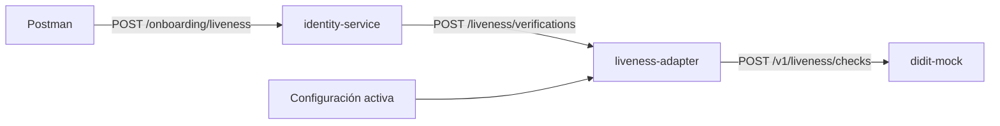

# Evidencia y protocolo — Experimento HA12

## 1. Propósito y separación de fases

El experimento valida el atributo **facilidad de modificación** ante el cambio de proveedor de liveness. No busca evaluar una aplicación de seguros completa ni la integración real de un proveedor alterno en esta primera fase.

| Fase | Objetivo | Resultado esperado |
|---|---|---|
| Preparación arquitectónica — actual | Construir la frontera que aisla Didit y establecer una línea base ejecutable. | Identity puede ejecutar onboarding sin conocer el contrato de Didit. |
| Ejecución del experimento — posterior | Implementar y activar un proveedor alterno. | El cambio de código queda contenido en `liveness-adapter`; la misma prueba de onboarding continúa pasando. |

La métrica de "cero archivos fuera del adaptador" comienza a contar desde el commit de esta preparación, no desde una versión previa que no tuviera puerto ni adaptador.

## 2. Componentes desplegados



| Componente | Puerto expuesto | Responsabilidad | Evidencia de desacoplamiento |
|---|---:|---|---|
| `identity-service` | 8001 | Recibe el onboarding y ejecuta el caso de uso. | Depende de `LivenessVerificationPort`, no de Didit. |
| `liveness-adapter` | 8002 | Selecciona el proveedor activo, normaliza y traduce contratos. | Único módulo que conoce Didit y su URL. |
| `didit-mock` | 8003 | Simula el contrato externo de Didit. | Permite pruebas repetibles sin PII, credenciales ni red externa. |

No se despliegan API Gateway ni BFF porque no contribuyen a probar el reemplazo del proveedor. Postman entra directamente a Identity, que es el consumidor que debe permanecer sin cambios.

## 3. Construcción interna con arquitectura hexagonal

### Identity Service

```text
domain/models.py                         Entidades normalizadas
application/ports.py                     LivenessVerificationPort
application/use_cases.py                 StartLivenessOnboarding
infrastructure/http_liveness_client.py   Adaptador HTTP hacia liveness-adapter
api/main.py                              Adaptador de entrada FastAPI
```

El caso de uso recibe un `LivenessVerificationPort`. No importa FastAPI, HTTPX ni componentes Didit. Esto hace que el consumidor sea estable aunque el proveedor se sustituya.

### Liveness Adapter

```text
domain/models.py                         VerificationCommand y VerificationResult
application/ports.py                     LivenessProvider y ActiveProviderConfiguration
application/use_cases.py                 VerifyLiveness y ChangeActiveProvider
infrastructure/didit_provider.py         Adaptador concreto Didit
infrastructure/configuration.py          Configuración activa en memoria
api/main.py                              API FastAPI y registro de proveedores
```

El adaptador traduce la solicitud interna (`customer_id`, `evidence_ref`) al contrato Didit (`subject_reference`, `selfie_reference`) y normaliza `PASSED`/`FAILED` a `approved`/`rejected`. Esos detalles no salen de este componente.

## 4. Línea base y pruebas disponibles

Las pruebas unitarias se encuentran junto al componente que validan:

| Archivo | Verificación |
|---|---|
| `identity-service/tests/test_onboarding_use_case.py` | Identity delega a su puerto sin conocer un proveedor concreto. |
| `liveness-adapter/tests/test_use_cases.py` | Se usa el proveedor configurado y no se puede seleccionar uno no registrado. |
| `didit-mock/tests/test_mock.py` | El mock devuelve `PASSED` o `FAILED` con evidencia sintética. |

Ejecutar todas las pruebas:

```powershell
cd identity-service; python -m pytest
cd ../liveness-adapter; python -m pytest
cd ../didit-mock; python -m pytest
```

Resultado de la línea base validada localmente: **5 pruebas unitarias aprobadas**. Los servicios también fueron levantados con Docker Compose y respondieron saludables en los puertos 8001, 8002 y 8003.

## 5. Evidencia de integración actual

Primero se confirma la configuración:

```http
GET http://localhost:8002/admin/liveness-provider
```

```json
{ "provider": "didit" }
```

Después se ejecuta el onboarding desde la colección Postman:

```http
POST http://localhost:8001/onboarding/liveness
X-Correlation-Id: ha12-runtime-001

{
  "customer_id": "customer-test-001",
  "evidence_ref": "synthetic-selfie-approved"
}
```

Respuesta normalizada esperada:

```json
{
  "verification_id": "didit-<uuid>",
  "status": "approved",
  "correlation_id": "ha12-runtime-001"
}
```

La evidencia operativa se obtiene con:

```powershell
docker compose logs identity-service liveness-adapter didit-mock
```

El mismo `correlation_id` debe aparecer en la solicitud de Identity, en la selección de Didit por el adaptador y en la recepción del mock. La colección [HA12-liveness.postman_collection.json](../postman/HA12-liveness.postman_collection.json) contiene las solicitudes y aserciones de Postman.

## 6. Ejecución posterior del experimento

1. Crear `liveness-adapter/app/infrastructure/alternative_provider.py`, que implemente `LivenessProvider`.
2. Registrar `alternative` dentro de `liveness-adapter`.
3. Ejecutar las pruebas unitarias y agregar las pruebas de contrato del proveedor alterno.
4. Con los contenedores levantados, activar el nuevo proveedor sin cambiar Identity ni Postman:

   ```http
   PUT http://localhost:8002/admin/liveness-provider

   { "provider": "alternative" }
   ```

5. Repetir `Onboarding aprobado` y `Onboarding rechazado` de la misma colección Postman.
6. Guardar respuestas, logs por `correlation_id`, duración de la implementación y el diff contra esta línea base.

## 7. Criterios de aceptación y evidencia final

| Criterio | Evidencia que debe entregarse |
|---|---|
| Implementación ≤ 3 días-persona | Registro de inicio/fin y horas-persona invertidas. |
| Solo cambia el adaptador | `git diff --name-only <commit-linea-base>..HEAD` muestra únicamente `liveness-adapter/`. |
| Onboarding sin regresión | Misma colección Postman, mismas aserciones y resultados en verde usando `alternative`. |
| El cambio se controla por configuración | `GET` y `PUT /admin/liveness-provider` antes y después, más logs con el proveedor alterno. |
| Contrato estable | Respuesta de Identity conserva `verification_id`, `status` y `correlation_id`; no expone DTOs de proveedores. |

Para la demostración, se recomienda mostrar en orden: diagrama de componentes, código de los puertos, pruebas unitarias en verde, `docker compose ps`, consulta del proveedor activo, ejecución de Postman y logs correlacionados. Después, en la segunda fase, se repetirá esa secuencia con `alternative` y se mostrará el diff limitado al adaptador.
