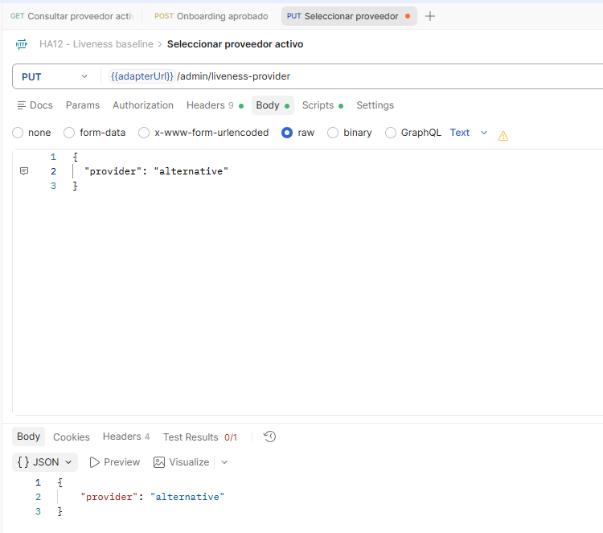
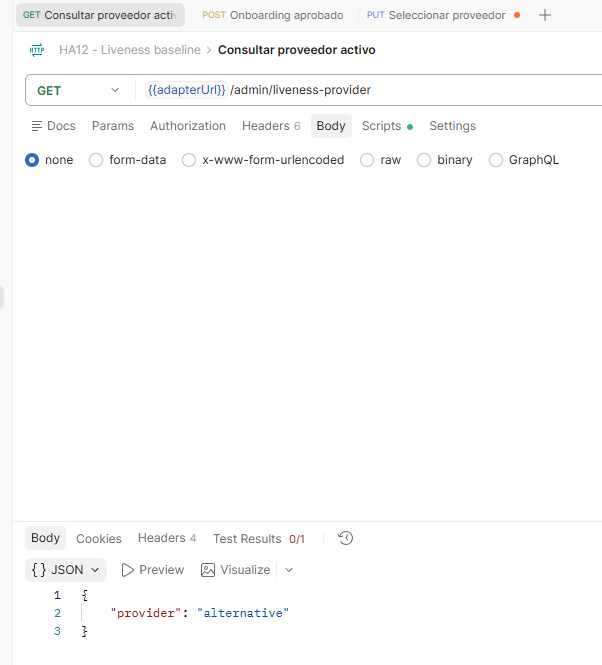
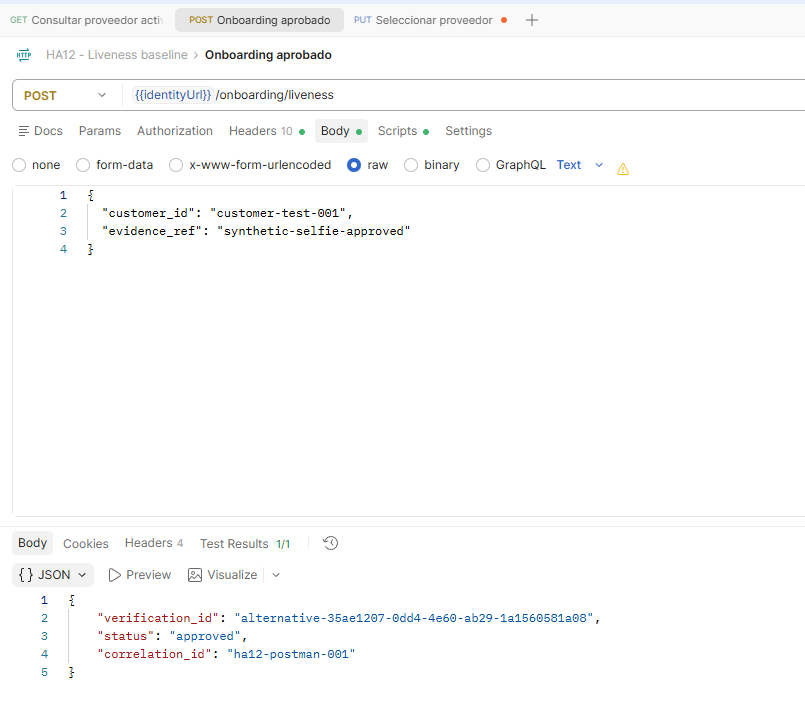
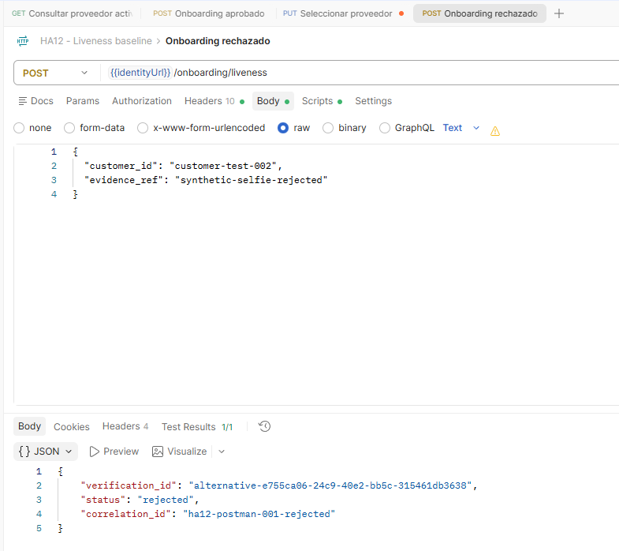
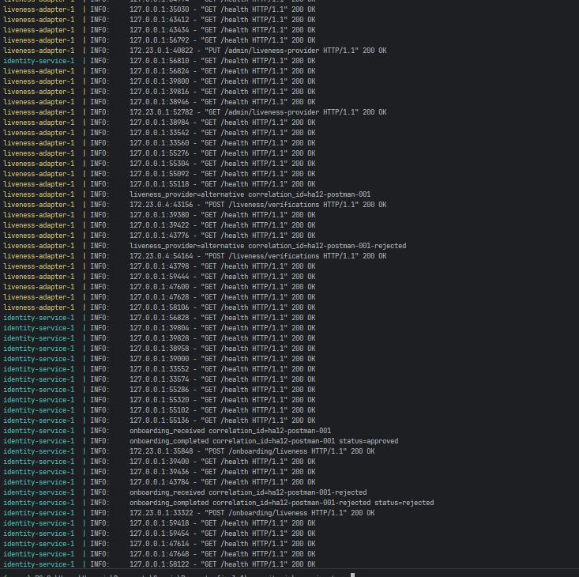
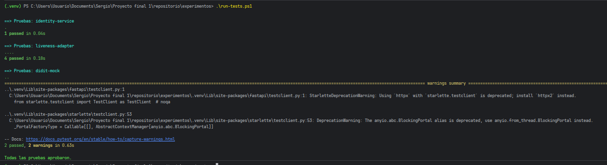
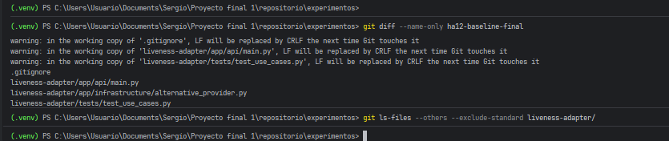

# Resultados — Experimento HA12: sustitución de proveedor de liveness

## 1. Resumen de ejecución

| Elemento | Resultado |
|---|---|
| Línea base | `ha12-baseline-final` |
| Proveedor inicial | `didit` (mock) |
| Proveedor incorporado | `alternative` (mock compatible con liveness pasivo) |
| Mecanismo de cambio | `PUT /admin/liveness-provider` en `liveness-adapter` |
| Servicios desplegados | `identity-service`, `liveness-adapter`, `didit-mock` |
| Pruebas automatizadas | 7 aprobadas |
| Resultado técnico de la hipótesis | Confirmado en el entorno controlado |

El experimento se ejecutó con un proveedor alterno simulado. Esto valida el aislamiento arquitectónico, la selección dinámica y la conservación del contrato de onboarding. No constituye certificación de una API comercial real; esa validación requeriría pruebas de contrato contra el sandbox del proveedor elegido.

## 2. Hipótesis y conclusión

> Al reemplazar el proveedor de prueba de vida mediante `LivenessProvider`, el flujo de onboarding se conserva sin cambios en Identity ni en el contrato consumido por Postman; el cambio se concentra en `liveness-adapter` y se activa por configuración.

**Conclusión:** la hipótesis se confirma para el alcance establecido. Se creó `AlternativeProvider`, que implementa el mismo puerto `LivenessProvider` que `DiditProvider`. `VerifyLiveness` seleccionó la implementación según el proveedor activo configurado, sin modificar `identity-service`, el endpoint de onboarding ni sus respuestas normalizadas.

Los resultados aprobado, rechazado y error técnico conservaron los estados esperados por Identity. El uso de IDs `alternative-*` y los logs con `liveness_provider=alternative` muestran que las solicitudes fueron atendidas por la nueva implementación.

## 3. Tácticas y patrones validados

| Táctica / patrón | Evidencia observada | Resultado |
|---|---|---|
| Usar un intermediario | Identity invoca solo el adaptador HTTP. | Identity no llama a Didit ni al proveedor alterno. |
| Encapsular | `AlternativeProvider` mantiene la decisión simulada `LIVE_CONFIRMED` / `NOT_LIVE` dentro del adaptador. | El consumidor recibe únicamente `approved` / `rejected`. |
| Aplazar el enlace | `PUT /admin/liveness-provider` cambia el proveedor activo. | La selección ocurre en ejecución, sin redesplegar Identity. |
| Strategy | `DiditProvider` y `AlternativeProvider` implementan `LivenessProvider`. | `VerifyLiveness` elige la estrategia configurada. |
| Adapter | Cada provider transforma su semántica específica al resultado normalizado. | El contrato público se mantiene estable. |

## 4. Evidencias de sustitución

**Figura 7. Activación del proveedor alterno.** La parametrización se actualiza exitosamente a `alternative` mediante la API administrativa del adaptador.

**Figura 8. Verificación de proveedor activo.** La consulta posterior confirma que `alternative` es la implementación seleccionada en tiempo de ejecución.

**Figura 9. Onboarding aprobado con el proveedor alterno.** Se conserva el mismo endpoint, request y contrato de respuesta; el prefijo `alternative-` evidencia la nueva implementación.

**Figura 10. Onboarding rechazado con el proveedor alterno.** El estado normalizado sigue siendo `rejected`, sin cambios en Identity ni Postman.

**Figura 11. Trazabilidad correlacionada.** Los logs de Identity y del adaptador comparten los identificadores de correlación y registran `liveness_provider=alternative`.

**Figura 12. Pruebas automatizadas.** La suite registra 1 prueba de Identity, 4 del adaptador y 2 del mock Didit: 7 pruebas aprobadas.

**Figura 13. Alcance del cambio.** La comparación contra la línea base lista la modificación del registro, el nuevo provider y sus pruebas bajo `liveness-adapter`.

## 5. Evaluación de criterios

| Criterio | Estado | Evidencia |
|---|---|---|
| Cambio activable por configuración | Cumplido | Figuras 7 y 8. |
| Onboarding E2E focalizado sin cambios | Cumplido | Figuras 9 y 10; mismo endpoint y contrato. |
| Trazabilidad del proveedor seleccionado | Cumplido | Figura 11. |
| Pruebas automatizadas en verde | Cumplido | Figura 12. |
| Código de implementación localizado en el adaptador | Cumplido para el código de producto | Figura 13. Los documentos y capturas son artefactos de reporte, no código de producto. |
| ≤ 3 días-persona | Pendiente de consignar | La duración real debe registrarse por el equipo; no se infiere de las capturas. |

## 6. Limitaciones y siguiente paso

El resultado valida una segunda estrategia mock compatible con la entrada `evidence_ref` de liveness pasivo. Si el proveedor real exige video, movimientos, patrones de luz o un SDK propio, se requiere una prueba adicional de compatibilidad de captura o un flujo genérico de sesión.

Para cerrar formalmente la métrica de esfuerzo, registrar en la bitácora del equipo la hora de inicio, hora de finalización e integrantes que implementaron `AlternativeProvider`. Cuando se elija un proveedor comercial, ejecutar las mismas pruebas contra su sandbox y agregar pruebas de contrato antes de promoverlo.
