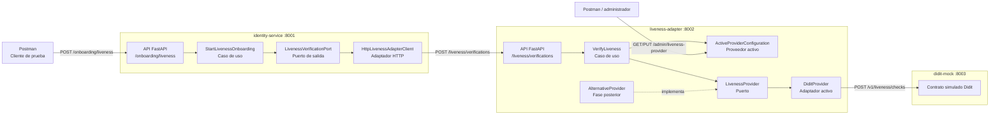
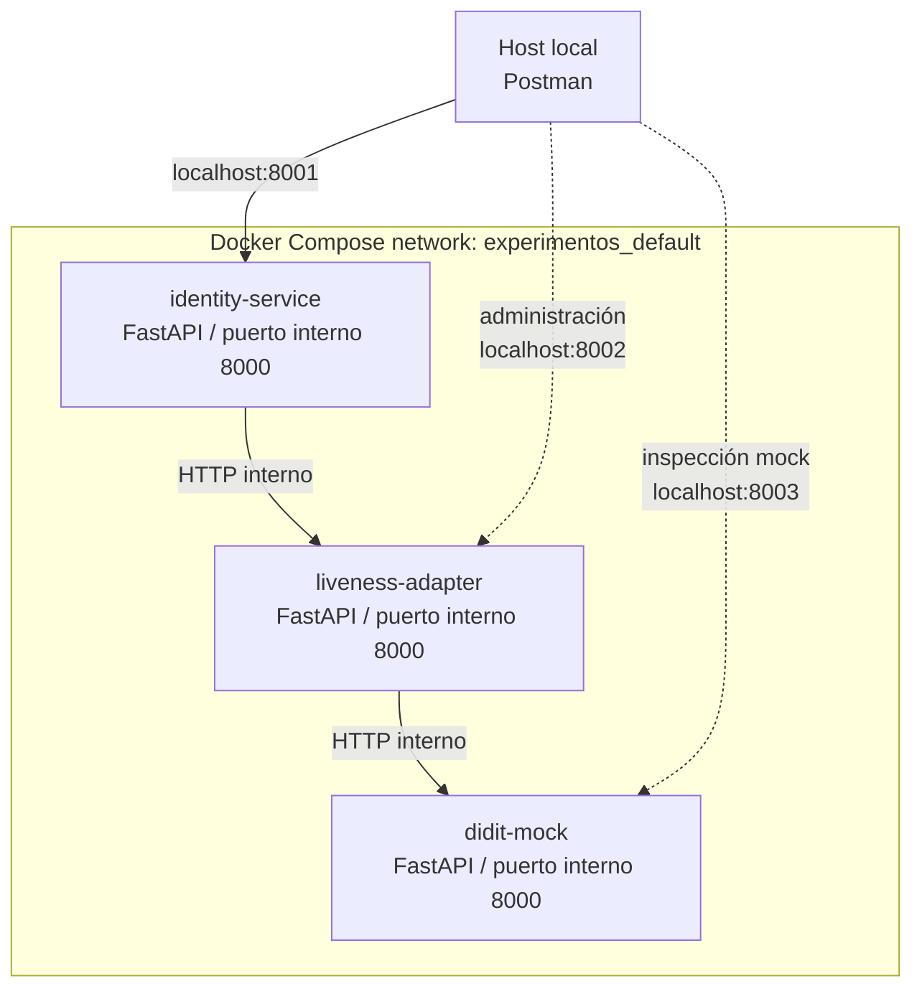
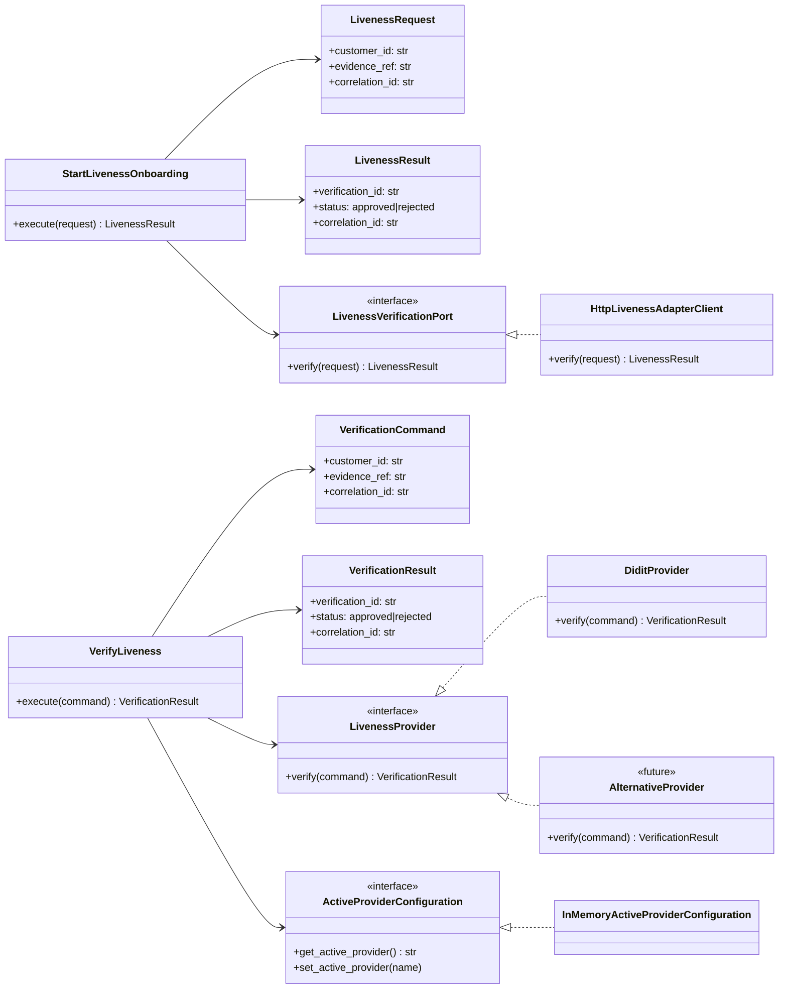
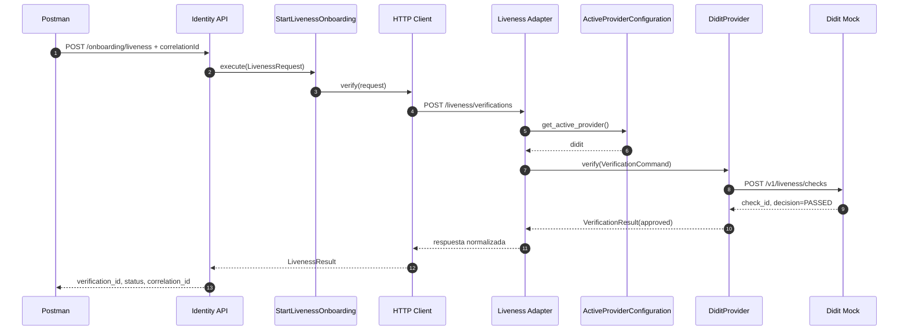
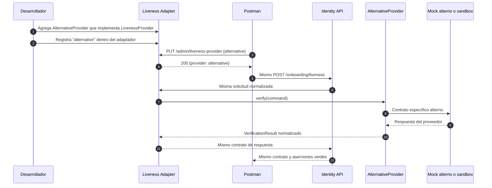
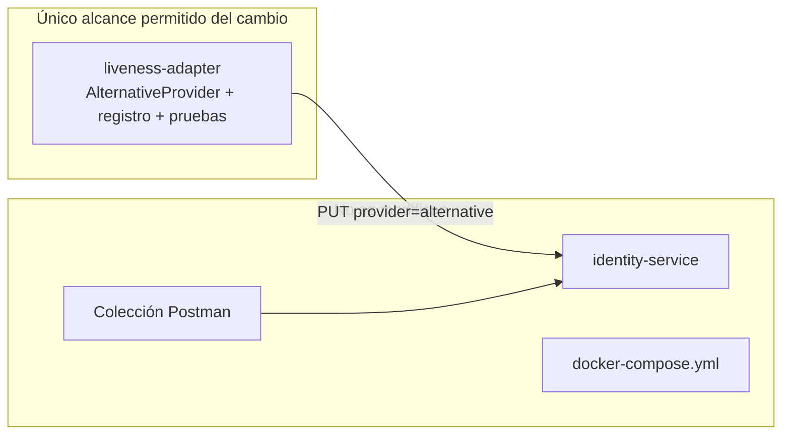

# Arquitectura visual — Preparación HA12

Estos diagramas complementan el protocolo del experimento. La línea continua representa los componentes que existen en la línea base; `AlternativeProvider` aparece punteado porque será construido y medido en la segunda fase.

## 1. Diagrama de componentes

**Lectura:** Identity no posee una dependencia hacia Didit ni hacia `AlternativeProvider`; su dependencia termina en `LivenessVerificationPort`. La selección y los DTO específicos permanecen dentro de `liveness-adapter`.

## 2. Diagrama de despliegue

| Servicio | Puerto del host | Health check |
|---|---:|---|
| Identity | 8001 | `GET /health` |
| Adaptador liveness | 8002 | `GET /health` |
| Didit mock | 8003 | `GET /health` |

## 3. Diagrama de clases y puertos

**Punto de extensión:** el proveedor nuevo debe implementar únicamente `LivenessProvider`. El caso de uso `VerifyLiveness`, Identity y los contratos normalizados no cambian.

## 4. Secuencia actual: Didit como proveedor activo

## 5. Secuencia futura: incorporación de `alternative`

## 6. Diagrama de alcance del cambio medido

La evidencia final se obtiene comparando el commit de línea base contra el commit de `AlternativeProvider`. El resultado de `git diff --name-only` debe listar únicamente rutas bajo `liveness-adapter/`.
